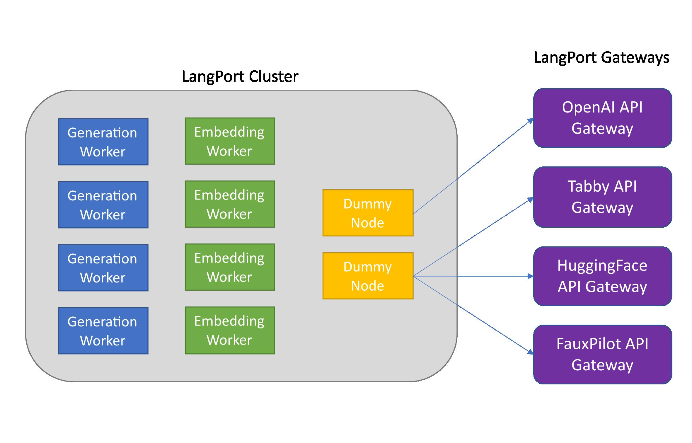

<div align="center">

# LangPort

<a href="https://github.com/vtuber-plan/langport">
  
</a>
<a href="https://github.com/vtuber-plan/langport/blob/main/LICENSE">
  
</a>



</div>

LangPort is a open-source large language model serving platform.
Our goal is to build a super fast LLM inference service.

This project is inspired by [lmsys/fastchat](https://github.com/lm-sys/FastChat), we hope that the serving platform is lightweight and fast, but fastchat includes other features such as training and evaluation make it complicated.

The core features include:
- Huggingface transformers support.
- ggml (llama.cpp) support.
- A distributed serving system for state-of-the-art models.
- Streaming generation support with various decoding strategies.
- Batch inference for higher throughput.
- Support for encoder-only, decoder-only and encoder-decoder models.
- OpenAI-compatible RESTful APIs.
- FauxPilot-compatible RESTful APIs.
- HuggingFace-compatible RESTful APIs.
- Tabby-compatible RESTful APIs.

## Support Model Architectures
* LLaMa, LLaMa2, GLM, Bloom, OPT, GPT2, GPT Neo, GPT Big Code and so on.

## Tested Models
* NingYu, LLaMa, LLaMa2, Vicuna, ChatGLM, ChatGLM2, Falcon, Starcoder, WizardLM, InternLM, OpenBuddy, FireFly, CodeGen, Phoenix, RWKV, StableLM and so on.

## News
- [2024/01/13] Introduce the `ChatProto`.
- [2023/08/04] Dynamic batch inference.
- [2023/07/16] Support int4 quantization.
- [2023/07/13] Support generation logprobs parameter.
- [2023/06/18] Add ggml (llama.cpp gpt.cpp starcoder.cpp etc.) worker support.
- [2023/06/09] Add LLama.cpp worker support.
- [2023/06/01] Add HuggingFace Bert embedding worker support.
- [2023/06/01] Add HuggingFace text generation API support.
- [2023/06/01] Add tabby API support.
- [2023/05/23] Add chat throughput test script.
- [2023/05/22] New distributed architecture.
- [2023/05/14] Batch inference supported.
- [2023/05/10] Langport project started.


## Install

### Method 1: With pip

```bash
pip install langport
```

or:

```bash
pip install git+https://github.com/vtuber-plan/langport.git 
```

If you need ggml generation worker, use this command:
```bash
pip install langport[ggml]
```

If you want to use GPU:
```bash
CT_CUBLAS=1 pip install langport[ggml]
```

### Method 2: From source

1. Clone this repository
```bash
git clone https://github.com/vtuber-plan/langport.git
cd langport
```

2. Install the Package
```bash
pip install --upgrade pip
pip install -e .
```

## Quick start
It is simple to start a local chat API service:

First, start a worker process in the terminal:
``` bash
python -m langport.service.server.generation_worker --port 21001 --model-path <your model path>
```

Then, start a API service in another terminal:
``` bash
python -m langport.service.gateway.openai_api
```
Now, you can use the inference API by openai protocol.

## Start the server

It is simple to start a single node chat API service:
``` bash
python -m langport.service.server.generation_worker --port 21001 --model-path <your model path>
python -m langport.service.gateway.openai_api
```

If you need a single node embeddings API server:
```bash
python -m langport.service.server.embedding_worker --port 21002 --model-path bert-base-chinese --gpus 0 --num-gpus 1
python -m langport.service.gateway.openai_api --port 8000 --controller-address http://localhost:21002
```

If you need the embeddings API or other features, you can deploy a distributed inference cluster:
``` bash
python -m langport.service.server.dummy_worker --port 21001
python -m langport.service.server.generation_worker --model-path <your model path> --neighbors http://localhost:21001
python -m langport.service.server.embedding_worker --model-path <your model path> --neighbors http://localhost:21001
python -m langport.service.gateway.openai_api --controller-address http://localhost:21001
```

In practice, the gateway can connect to any node to distribute inference tasks:

``` bash
python -m langport.service.server.dummy_worker --port 21001
python -m langport.service.server.generation_worker --port 21002 --model-path <your model path> --neighbors http://localhost:21001
python -m langport.service.server.generation_worker --port 21003 --model-path <your model path> --neighbors http://localhost:21001 http://localhost:21002
python -m langport.service.server.generation_worker --port 21004 --model-path <your model path> --neighbors http://localhost:21001 http://localhost:21003
python -m langport.service.server.generation_worker --port 21005 --model-path <your model path> --neighbors http://localhost:21001 http://localhost:21004
python -m langport.service.gateway.openai_api --controller-address http://localhost:21003 # 21003 is OK!
python -m langport.service.gateway.openai_api --controller-address http://localhost:21002 # Any worker is also OK!
```

Run text generation with multi GPUs:

``` bash
python -m langport.service.server.generation_worker --port 21001 --model-path <your model path> --gpus 0,1 --num-gpus 2
python -m langport.service.gateway.openai_api
```

Run text generation with ggml worker:

```bash
python -m langport.service.server.ggml_generation_worker --port 21001 --model-path <your model path> --gpu-layers <num layer to gpu (resize this for your VRAM)>
```

Run OpenAI forward server: 
```bash
python -m langport.service.server.chatgpt_generation_worker --port 21001 --api-url <url> --api-key <key>
```


## License

langport is released under the Apache Software License.


## See also

- [langport-docs](https://github.com/vtuber-plan/langport/tree/main/docs)
- [langport-source](https://github.com/vtuber-plan/langport)


## Star History

[](https://star-history.com/#vtuber-plan/langport&Date)

